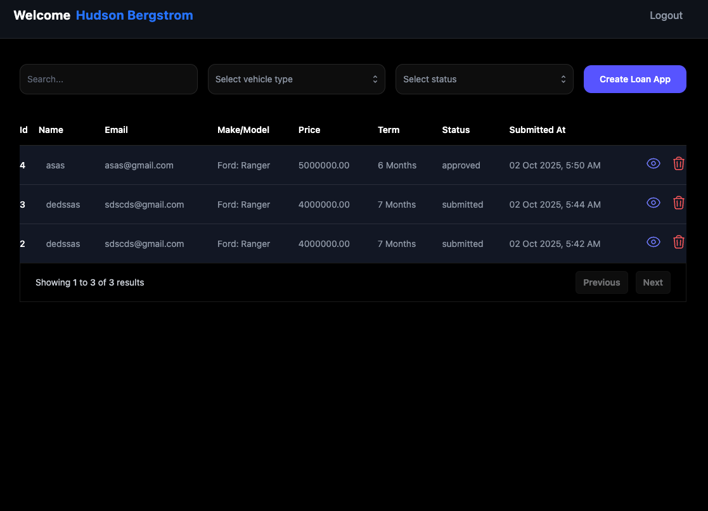
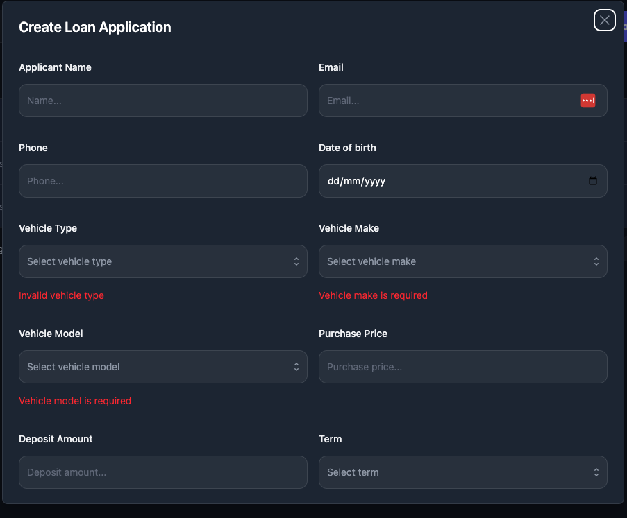
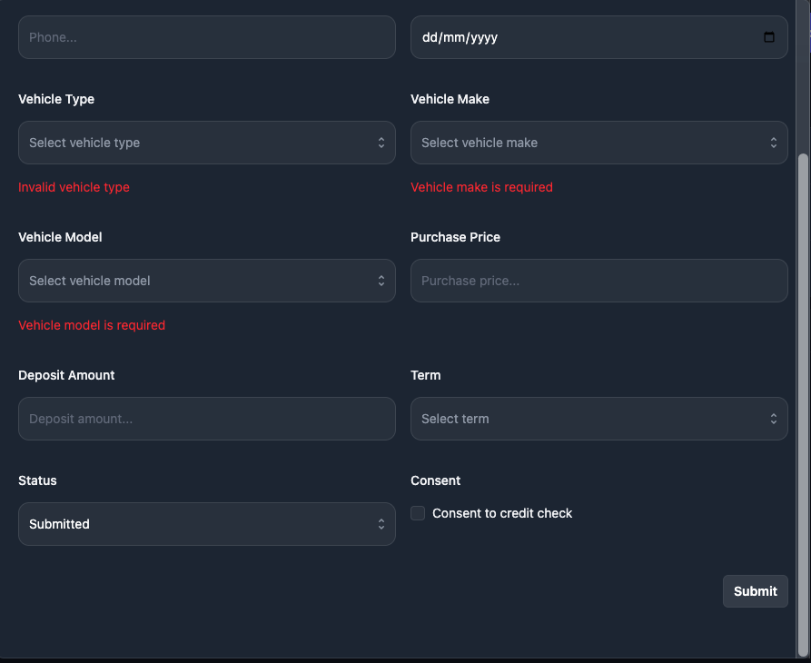
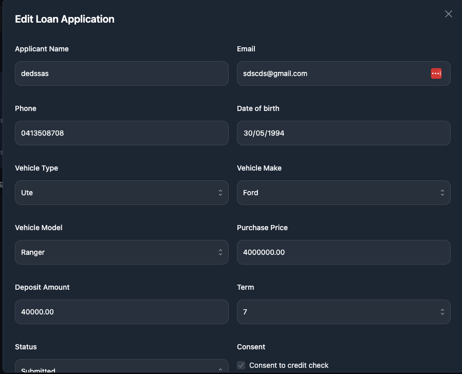
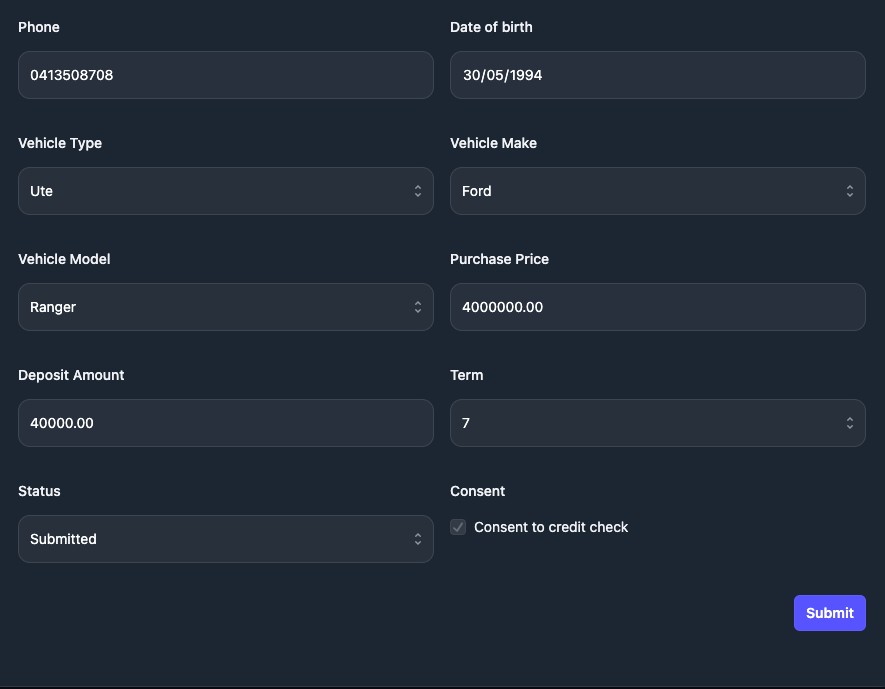

# LoanAppTest Frontend

## N:B
Ensure this repo is installed in the same directory as the docker repo and docker is running

### ENV Setup
- VITE_APP_ENV=local
- VITE_URL=http://loanapp.test:5173
- VITE_API_URL=http://loanapp.test:8004

### Command RUNs
- npm install

### Screenshots

 

 
